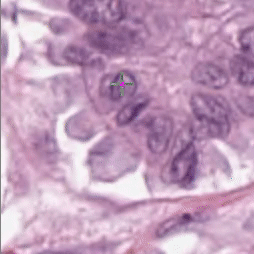

<<<<<<< HEAD
# DRL-Enhanced-Interactive-Segmentation-PyTorch-Implementation-
This project enhances interactive segmentation by incorporating Deep Reinforcement Learning (DRL) to refine user-provided click positions before using NuClick for segmentation. The primary goal is to adjust user clicks towards the center of objects, improving segmentation accuracy.
=======
# DRL-Enhanced Interactive Segmentation (PyTorch Implementation)

This project enhances interactive segmentation by incorporating Deep Reinforcement Learning (DRL) to refine user-provided click positions before using NuClick for segmentation. The primary goal is to adjust user clicks towards the center of objects, improving segmentation accuracy.

## Overview
This repository provides a PyTorch implementation of a two-step interactive segmentation approach:

1. **User Click Adjustment Module (Reinforcement Learning-based)**: 
   - Users provide an initial interaction point.
   - A Deep Reinforcement Learning (DRL) model refines this point to be closer to the center of the target object.
   - The model computes Euclidean distances to optimize the click position using a reward-based mechanism.

2. **Segmentation Module (NuClick-based)**: 
   - The refined click is passed to NuClick.
   - NuClick performs instance segmentation based on the adjusted click.
   - The final segmented output is produced.


For more details on the network architecture and training process, please refer to the following papers:

- **Navid Alemi, Mostafa Jahanifar, et al.** "NuClick: A deep learning framework for interactive segmentation of microscopic images." *Medical Image Analysis* 65 (2020): 101771.
- **Mostafa Jahanifar, Navid Alemi Koohbanani, and Nasir Rajpoot.** "NuClick: From clicks in the nuclei to nuclear boundaries." *arXiv preprint* arXiv:1909.03253 (2019).

## Demonstration of Center Selection
The following GIFs demonstrate how the system refines the user click to select the optimal center for each object:





## Installation

### Install Dependencies
Ensure PyTorch is installed according to the official [PyTorch installation guide](https://pytorch.org/get-started/locally/). If you intend to use GPU acceleration, ensure you have the appropriate version of CUDA Toolkit installed before proceeding.

Then, install the required dependencies using:

```bash
pip install -r requirements.txt
```

> This repository has been tested with PyTorch 1.9 and 1.10 but should work with newer versions as well.

## Using Pretrained Models

We provide pretrained model weights for both steps:

1. **Reinforcement Learning Click Adjustment Model** (Improves initial user clicks).
2. **NuClick Segmentation Model** (Processes the refined clicks for segmentation).

### Running Inference
Once the pretrained weights are downloaded, you can use the `predict.py` script:

```bash
python predict.py --model drl_nuclick -w "checkpoints/DRL_NuClick.pth" -i input_image.png -p input_points.csv -o "path/to/save/output/"
```

Alternatively, process multiple images with:

```bash
python predict.py --model drl_nuclick -w "checkpoints/DRL_NuClick.pth" -imgdir "path/to/images/" -pntdir "path/to/points/" -o "path/to/save/"
```

Each image in `imgdir` must have a corresponding CSV file in `pntdir` containing point annotations.

For more options, run:

```bash
python predict.py -h
```

> **Note:** NuClick's instance maps are saved in `uint16` format. To visualize them, use OpenCV or Scikit-Image with `matplotlib.pyplot`.

## Simple Demo GUI
A demo GUI is available for quick interactive segmentation testing. To use it:

1. Ensure the correct path to saved weights is set in the `TestConfig` class inside `config.py`.
2. Run the demo:

```bash
python demo.py
```

This will open a file browser to select an image. Click on nuclear instances near their centroid, and press:

- **R** to restart point selection
- **C** to confirm selection and process the image

The segmented output is displayed and saved in the same directory as the original image.

## Training the Models
If you wish to fine-tune the models on your own dataset, follow these steps:

### 1. Reinforcement Learning Training
- The click adjustment model uses a DRL-based agent.
- Training is handled in `DRL+segmentation.py`.
- Ensure training data consists of interaction points and ground truth center locations.

To train the model, run:

```bash
python DRL+segmentation.py --epochs 50 --gpu 0
```

### 2. NuClick Patch Extraction & Training
NuClick requires specialized training data with "inclusion" and "exclusion" guiding signals. Use `patch_extraction_single.py` to generate patches from existing instance segmentation datasets.

To train the segmentation model:

```bash
python train.py --epochs 50 --gpu 0
```

## License
This project is licensed under the [Attribution-NonCommercial-ShareAlike 4.0 International License](http://creativecommons.org/licenses/by-nc-sa/4.0/). If using the pretrained weights, consider the licensing implications for your work.

>>>>>>> 05c1497 (first_commit_push)
